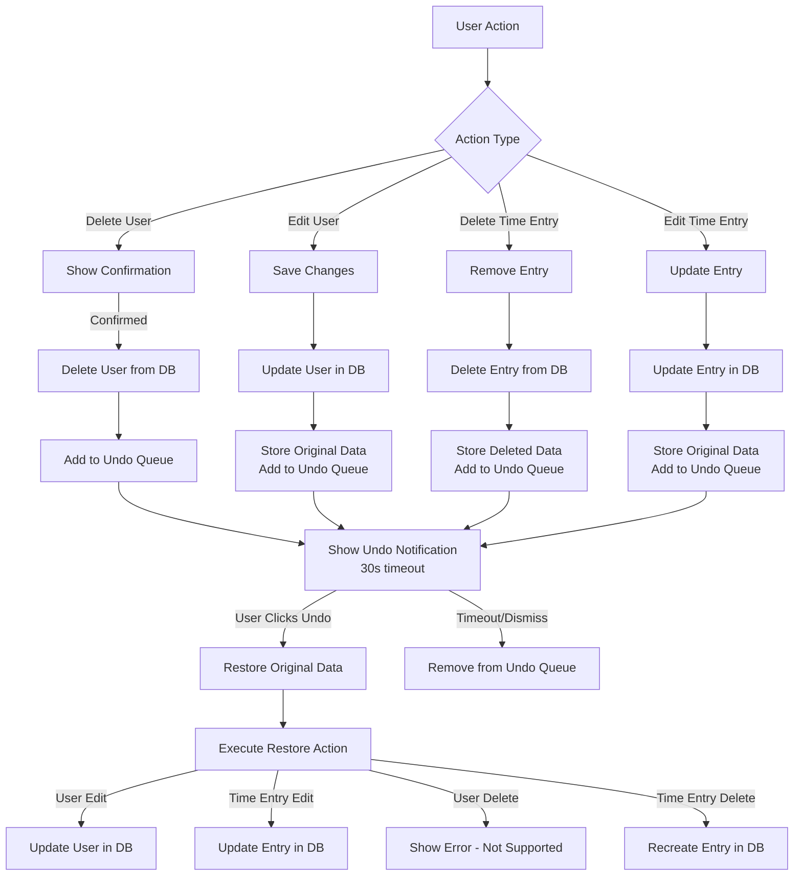

# Undo Functionality in Admin Dashboard

## Workflow Diagram



## Implementation Details

### 1. Undo Action Structure
```typescript
interface UndoAction {
  id: string;
  type: 'delete-user' | 'delete-time-entry' | 'edit-user' | 'edit-time-entry';
  data: any;
  timeoutId: NodeJS.Timeout;
}
```

### 2. State Management
- `undoActions`: Array of pending undo actions
- `showUndoNotification`: Boolean to show/hide notification
- `currentUndoAction`: Currently displayed undo action

### 3. Supported Undo Operations
- ✅ Edit User: Reverts user information changes
- ✅ Edit Time Entry: Reverts time entry changes
- ✅ Delete Time Entry: Recreates deleted time entries
- ❌ Delete User: Not supported due to password requirements

### 4. Timeout Handling
- Each undo action has a 30-second timeout
- After timeout, action is automatically removed from queue
- Manual dismissal also removes the action

## User Experience
1. User performs a delete/edit action
2. System shows success notification with undo option
3. User has 30 seconds to click "Undo" or notification disappears
4. If undone, system restores previous state
5. If not undone within 30 seconds, action becomes permanent